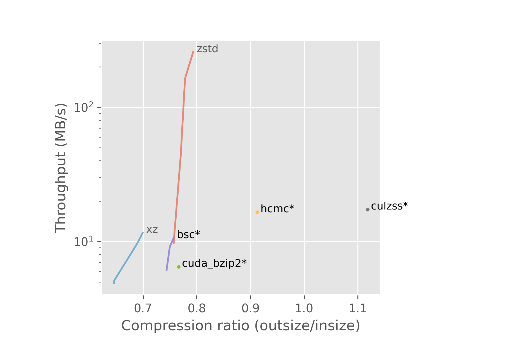

**Stefan Rua** \
`stefan.rua@iki.fi` \
\
**Andrea Bocci** \
`andrea.bocci@cern.ch` \
\
\

We present the results of a study on the use of GPUs for data compression, using collision data collected by the CMS experiment as a case study.

## Introduction

<!--
The Compact Muon Solenoid (CMS) is a detector and an experiment at CERN. It gathers data on collisions taking place in the Large Hadron Collider (LHC). Not all of the data contains interesting events, and it goes through multiple levels of triggers where most of it is discarded. The last trigger is the High Level Trigger (HLT), from which the data is sent to datacenters away from the detector. In order to speed up the network transfers between the HLT and datacenters, the data is compressed.
-->

The Large Hadron Collider (LHC) at CERN can accelerate and collide protons or heavier ions, usually lead nuclei. The Compact Muon Solenoid (CMS) experiment uses a complex detector to analyse the particles produced in these collisions. As the LHC can generate collisions up to 40 MHz, which would result in too much data to be read out and stored for offline processing, CMS uses a trigger system with two level to select only the most interesting collision events: the first level, called Level-1 Trigger, uses FPGAs and dedicated electronics to reduce the data rate to a maximum of 100 kHz; the last level, call High Level Trigger (HLT), runs a streamlined version of the CMS reconstruction software (CMSSW) on a computer farm to further reduce the data rate to an average of a few kHz; from the beginning of Run-3 in 2022 the HLT farm has been equipped with GPUs. The data selected by the HLT is transferred to the Tier-0 datacentre in the CERN campus for storage and further processing. In order to speed up the data aggregation inside the HLT and the network transfers between the HLT and Tier-0, the data is compressed.

## Motivation

<!--
Currently the data is compressed using CPUs which are used for other workloads as well. The machines at the HLT are equipped with GPUs, so it would be good to reduce CPU time taken by the compression workload by transferring it onto the GPUs.
-->

Currently the data are compressed using CPUs; as the HLT machines are equipped with GPUs, we investigate the possibility of offloading the data compression to GPUs, to free up the CPUs for performing other tasks.
We also investigate the performance of the NX on-chip data compression accelerator integrated in the IBM POWER9 processors; while such machines are not used at HLT, they are used at HPC sites that run the CMS reconstruction software.

## Benchmarking

We implemented the compressors into a benchmarking program called `lzbench`[^lzbench]. When possible, compressors are compiled with the same compiler options to achieve the fairest possible comparison. `lzbench` runs the compression in memory, meaning that disk reads and writes are excluded.
The benchmarks were run on two machines: one with a configuration similar to the machines in the HLT farm, and a POWER9 machine.

### HLT-like machine

This machine is equipped with two AMD EPYC "Milan" 75F3 CPUs[^amd_epyc] and two NVIDIA T4 GPUs[^nvidia_t4]:

- AMD EPYC 75F3
    - 32 cores
    - 2.95 GHz base / 4.0 GHz boost clock
    - 256 MB L3 cache
- NVIDIA Tesla T4
    - 2560 CUDA cores
    - 585 MHz base / 1590 MHz boost clock
    - 16 GB GDDR6

### POWER9 machine

This machine has an IBM POWER9 CPU[^p9] and four NVIDIA V100 GPUs[^nvidia_v100]:

- 8335-GTH / IBM Power System AC922
- IBM POWER9
    - 32 cores
    - max. 4 GHz
    - 320 MB L3 cache
- 4 x NVIDIA Tesla V100
    - 5120 CUDA cores
    - 1530 MHz boost clock
    - 32 GB HBM2

## Compressors

<!--
| Name | Description |
|:---|:---|
| `bsc`[^bsc] | **B**lock-**s**orting **c**ompressor by Ilya Grebnov. |
| `dietgpu`[^dietgpu] | Asymmetric numeral systems (ANS)[^ans] implementation by Facebook. |
| `libxz`[^libnxz]^,^[^libnxz_git] | IBM's POWER9 processors have a hardware accelerator, NX, for `gzip`. `libnxz` is the library for compressing on it. |
| `nvcomp`[^nvcomp]^,^[^nvcomp_git] | Compression library by NVIDIA, unfortunately made proprietary in version 2.3. |
-->

As a starting point, we have measured the performance of the lossless data compressors that can be used natively in CMSSW, runing only on CPU:

- **LZ4**[^lz4] \
lz4 is a compression algorithm that prioritizes speed, based on the LZ77 dictionary compression. \
- **zlib**[^zlib] \
`zlib` is a compression library that implements the DEFLATE algorithm; it combines a dictionary-matching stage based on LZ77 and a Huffman entropy coding stage. \
- **LZMA**[^lzma] \
the Lempel–Ziv–Markov chain algorithm is an algorithm that prioritizes compression ratio over speed, using a variant of the LZ77 dictionary compression algorithm followed by a probability-based range encoder. \
- **Zstandard**[^zstd] \
Zstandard is a fast compression algorithm providing high compression ratios; it combines a dictionary-matching stage based on LZ77 with a large search window and a fast entropy-coding stage, using both Huffman coding and a fast tabled version of Asymmetric Numeral Systems[^ans] (ANS). \

We then explored the most promising compressors that can offload at least part of their computation to GPUs:

- **bsc**[^bsc] \
The Block-Sorting Compressor by Ilya Grebnov. \
- **dietgpu**[^dietgpu] \
A GPU implementation of the Asymmetric Numeral Systems[^ans] (ANS) being developed at Facebook. \
- **nvcomp**[^nvcomp] \
A GPU compression library developed by NVIDIA, unfortunately made proprietary in version 2.3. We tested the earlier open source version which was already in `lzbench`.

Finally, we benchmarked the POWER9 NX compression hardware using `libnxz`:
- **libnxz**[^libnxz] \
libnxz implements a `zlib`-compatible API for Linux userspace programs that exploit the NX accelerator available on POWER9 and newer processors. \

<!--
- `bsc`[^bsc] \
**B**lock-**s**orting **c**ompressor by Ilya Grebnov. \
- `dietgpu`[^dietgpu] \
Asymmetric numeral systems (ANS)[^ans] implementation by Facebook. \
- `libxz`[^libnxz]^,^[^libnxz_git] \
IBM's POWER9 processors have a hardware accelerator, NX, for `gzip`. `libnxz` is the library for compressing on it. \
- `nvcomp`[^nvcomp]^,^[^nvcomp_git] \
Compression library by NVIDIA, unfortunately made proprietary in version 2.3.

[^bsc]: <https://github.com/IlyaGrebnov/libbsc>
[^ans]: <https://arxiv.org/pdf/1311.2540.pdf>
[^dietgpu]: <https://github.com/facebookresearch/dietgpu>
[^libnxz]: <https://dl.acm.org/doi/pdf/10.1109/ISCA45697.2020.00012>
[^libnxz_git]: <https://github.com/libnxz/power-gzip>
[^nvcomp]: <https://developer.nvidia.com/nvcomp>
[^nvcomp_git]: <https://github.com/NVIDIA/nvcomp>
-->

## Input samples and results

Two types of collisions take place at the LHC: proton-proton and heavy ion collisions. We ran the benchmarks on both types of data. In the benchmarks these events have been compressed individually, rather than as a batch, to replicate the approach used by the HLT where the events are compressed individually to ease their aggregation.

### Proton-proton events sample

The first set of measurements were performed using 100 events from proton-proton collisions collected on August 11th, 2022 with an average pileup of 50 collisions per event. Their uncompressed size ranges between 1.4 MB and 2.1 MB, with an average of 1.7 MB per event.

<!--
- HadronsTaus stream from 2022
- pileup $\approx$ 50
- 100 files
- 170 MB
- 1 event per file
- 1.4 MB to 2.1 MB each
-->

### Proton-proton events compression results

### Heavy ion events sample

The second set of measurements were performed using 100 events from lead-lead collisions collected on November 25th, 2018. Their uncompressed size ranges between 640 kB and 5.5 MB, with an average of 1.3 MB per event.

<!--
- from 2018
- 100 files
- 131 MB
- 1 event per file
- 644 KB to 5.5 MB each
-->

### Heavy ion events compression results

<!--
## Timing

- Wall time
- Disk $\rightarrow$ RAM **excluded**
- RAM $\rightarrow$ GPU memory **included**
- Fastest from 5 repeats
-->

<!--
## Results

## First simple tests

Note: these were simply run from the command line and timed using the `time` command, so copying from disk to RAM and back is included.

{ width=80% }
-->

## Conclusion and future work

Using the CPU compressor `zstd` is a reasonable choice with our current hardware and the current state of GPU compressors. `dietgpu` is promising, and may see significant improvements in the future, as it is in a very early stage in development. `dietgpu` uses a compression algorithm called Asymmetric Numeral Systems, which is an important part of `zstd` as well. This looks promising for a future GPU implementation of `zstd`.

In the future it will be interesting to benchmark other hardware accelerated compression engines, like Intel Quick Assist that will be available in the upcoming Intel Sapphire Rapids Xeon CPUs.

Our fork of lzbench[^lzbench_fork] and the code used to generate the plots[^gpucomp] are available on github.

## References

[^bsc]: **libbsc** \
A program and a library for lossless, block-sorting data compression \
<https://github.com/IlyaGrebnov/libbsc>

[^ans]: **Asymmetric numeral systems** \
Entropy coding combining speed of Huffman coding with compression rate of arithmetic coding \
<https://arxiv.org/pdf/1311.2540.pdf>

[^dietgpu]: **DietGPU** \
GPU-based lossless compression for numerical data \
<https://github.com/facebookresearch/dietgpu>

[^libnxz]: **libnxz** \
A zlib-compatible API for Linux userspace programs that exploit the NX GZIP accelerator available on POWER9 processors \
<https://github.com/libnxz/power-gzip>

[^nvcomp]: **nvcomp** \
Data Compression Using NVIDIA GPUs \
<https://developer.nvidia.com/nvcomp>

[^lzbench]: **lzbench** \
An in-memory benchmark of open-source LZ77/LZSS/LZMA compressors \
<https://github.com/inikep/lzbench>

[^lzbench_fork]: **Our fork of lzbench** \
<https://github.com/stefanrua/lzbench>

[^gpucomp]: **gpucomp** \
Code for generating plots and this poster \
<https://github.com/stefanrua/gpucomp>

[^amd_epyc]: **AMD EPYC 75F3** \
<https://www.amd.com/en/product/10931>

[^nvidia_t4]: **NVIDIA T4** \
<https://www.nvidia.com/content/dam/en-zz/Solutions/design-visualization/technologies/turing-architecture/NVIDIA-Turing-Architecture-Whitepaper.pdf>

[^p9]: **IBM POWER9** \
<https://www.ibm.com/common/ssi/ShowDoc.wss?docURL=/common/ssi/rep_sm/5/872/ENUS8335-_h05/index.html>

[^nvidia_v100]: **NVIDIA V100** \
<https://images.nvidia.com/content/volta-architecture/pdf/volta-architecture-whitepaper.pdf>

[^zlib]: **zlib** \
A compression library that implements the DEFLATE algorithm \
<https://en.wikipedia.org/wiki/Zlib>

[^lz4]: **LZ4** \
An algorithm based on LZ77 that prioritizes speed \
<https://en.wikipedia.org/wiki/LZ4_(compression_algorithm)>

[^lzma]: **LZMA** \
The Lempel–Ziv–Markov chain algorithm \
<https://en.wikipedia.org/wiki/Lempel-Ziv-Markov_chain_algorithm>

[^zstd]: **Zstandard** \
A compressor that combines ANS and LZ77 \
<https://en.wikipedia.org/wiki/Zstd>

<!--
| Name | Device | Code |
|:-----|:-------|:-------|
| `bsc` | GPU | <https://github.com/IlyaGrebnov/libbsc> |
| `dietgpu` | GPU | <https://github.com/facebookresearch/dietgpu> |
| `libnxz` | IBM NX | <https://github.com/libnxz/power-gzip> |
| `lz4` | CPU | <https://github.com/lz4/lz4> |
| `lzma` | CPU | <https://www.7-zip.org/> |
| `nvcomp_lz4` | GPU | <https://github.com/NVIDIA/nvcomp> |
| `zlib` | CPU | <http://zlib.net/> |
| `zstd` | CPU | <https://github.com/facebook/zstd> |
-->

<!--
| Name | Device | Code |
|:-----|:-------|:-------|
| `bsc` | GPU | <https://github.com/IlyaGrebnov/libbsc> |
| `culzss` | GPU | <https://github.com/adnanozsoy/CUDA_Compression> |
| `dietgpu` | GPU | <https://github.com/facebookresearch/dietgpu> |
| `hcmc` | GPU | <https://github.com/smadhiv/HuffmanCoding_MPI_CUDA> |
| `libnxz` | IBM NX | <https://github.com/libnxz/power-gzip> |
| `lz4` | CPU | <https://github.com/lz4/lz4> |
| `lzma` | CPU | <https://www.7-zip.org/> |
| `nvcomp_lz4` | GPU | <https://github.com/NVIDIA/nvcomp> |
| `xz` | CPU | <https://tukaani.org/xz/> |
| `zlib` | CPU | <http://zlib.net/> |
| `zstd` | CPU | <https://github.com/facebook/zstd> |
-->
