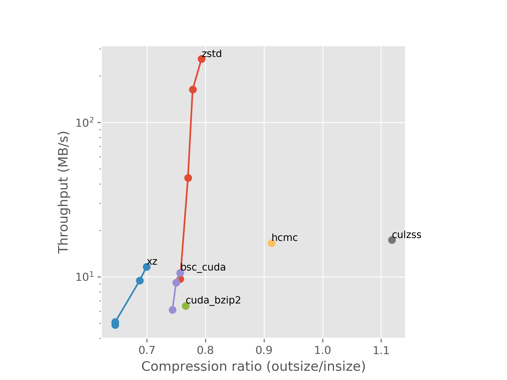
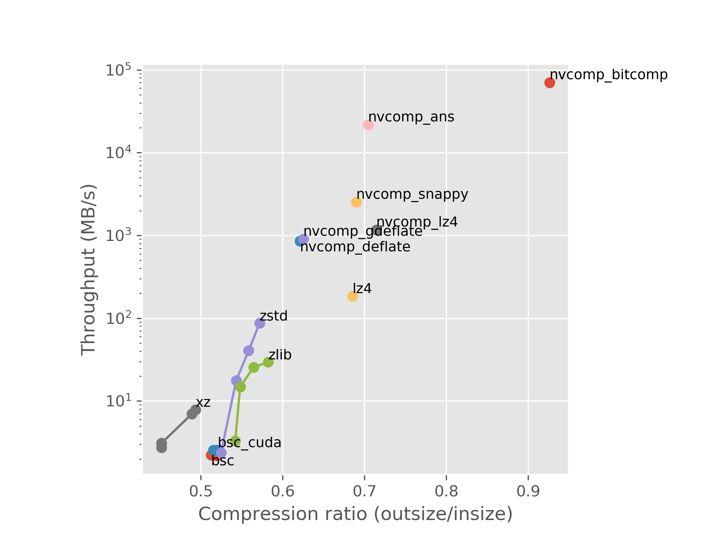

# Introduction

The data produced by CMS's HLT is compressed, and currently this is done using CPUs. However, as new computers with powerful GPUs have been acquired, it would be nice to transfer some of the load onto the GPUs. This is the motivation for finding a good GPU-enabled compressor.

GPU-enabled compressors aren't widely adopted yet (?), but in the last ten years some researchers and companies have showed interest in the topic.

# Algorithms

## Burrows-Wheeler transform

## Huffman coding

## The Lempel-Ziv family

## Asymmetric numeral systems

# CPU compressors

## Zstandard

Zstandard (zstd) is the compressor that is currently used for HLT data. It is used as a reference point for all comparisons in this report.

## xz

Another point of comparison running on the CPU is xz, which achieves great compression ratios at the cost of throughput.

# GPU compressors

## BSC

BSC[^bsc] is a GPU accelerated block-sorting compressor. The default makefile doesn't compile the necessary files for CUDA support, so a few changes were needed (?). Multiple block sorting algorithms are available: the Burrows-Wheeler transform and sort transforms of order 3 to 8 (?). Only sort transforms of order 5 to 8 can use the GPU, of which 7 and 8 use it by default and 5 and 6 require and additional flag for it.

[^bsc]: <https://github.com/IlyaGrebnov/libbsc>

## CULZSS

CULZSS[^culzss] is a CUDA implementation of LZSS. CULZSS-bit[^culzss-bit], a more recent and reportedly better performing version exists, but no source code or binary is available for it. I emailed the author, but he couldn't find the code either. He also mentioned that the code for the original CULZSS on github might not work.

[^culzss]: <https://github.com/adnanozsoy/CUDA_Compression>, <https://web.cs.hacettepe.edu.tr/~aozsoy/papers/2011-ppac.pdf>
[^culzss-bit]: <https://ieeexplore.ieee.org/stamp/stamp.jsp?tp=&arnumber=7079027>

## nvCOMP

nvCOMP[^nvcomp] is a library for GPU compression by Nvidia, and it implements Deflate, LZ4, Cascaded, Snappy, BitComp, and ANS. I expect nvCOMP's compressors to perform well, as it is in Nvidia's interest to make their GPUs look good. Unfortunately nvCOMP is proprietary.

[^nvcomp]: <https://developer.nvidia.com/nvcomp>

## DietGPU

DietGPU[^dietgpu] is a work-in-progress ("very early alpha preview") compression library by Facebook which implements ANS. As its purpose they state speeding up network transfers in a datacenter environment, which matches our use case. DietGPU provides two codecs: a general byte-oriented entropy encoder and decoder, and another one specifically for floating point data. At the time of writing only a Python API for PyTorch tensors is ready, but the underlying encoders and decoders are implemented in C++ and CUDA, making it possible to utilize library for other data as well.

[^dietgpu]: <https://github.com/facebookresearch/dietgpu>

## HuffmanCoding_MPI_CUDA

HuffmanCoding_MPI_CUDA[^hcmc] performs Huffman compression with the option of using CUDA, MPI, CUDA and MPI, or no parallelization at all. I used it on the CUDA setting.

[^hcmc]: <https://github.com/smadhiv/HuffmanCoding_MPI_CUDA>

## cuda_bzip2

cuda_bzip2[^cuda_bzip2] is a modified version of bzip2 with CUDA support.

[^cuda_bzip2]: <https://github.com/aditya12agd5/cuda_bzip2>

# Method

## Crude first tests

As a first step I ran the compressors from the command line, measuring the time taken by them using the `time` command. This gave me a rough idea of their performance, based on which I selected the ones to examine in more detail.

## Finer evaluation

lzbench[^lzbench] is an in-memory benchmarking tool for compressors. Excluding the time taken read and write files from the disk gives a more accurate idea of the compressor's throughput. I added the most promising compressors to lzbench.

I failed to add nvCOMP to lzbench, so its results are the ones reported by Nvidia's own proprietary benchmarking binaries. I expect these to exclude all possible overhead, such as copying the files to GPU memory from RAM.

[^lzbench]: <https://github.com/inikep/lzbench>

# Results

{ width=80% }

{ width=80% }

\newpage

# Discussion

# Conclusion
