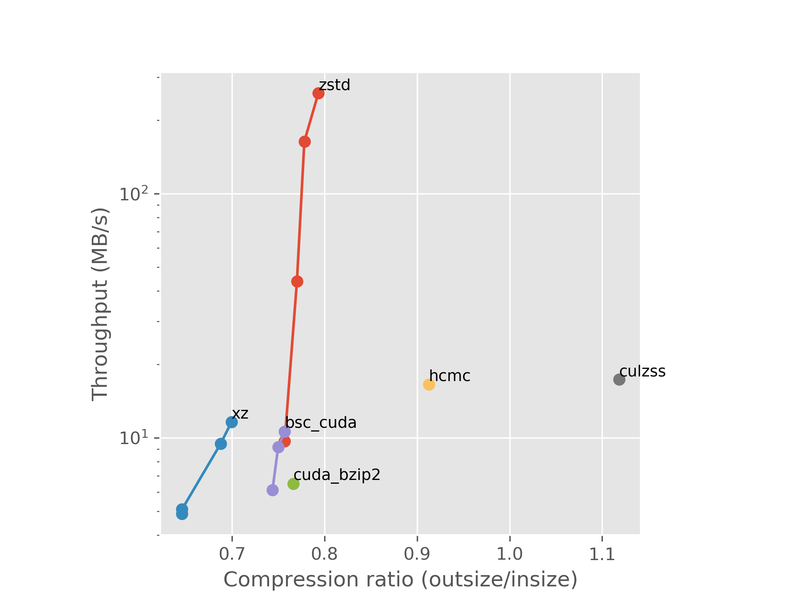
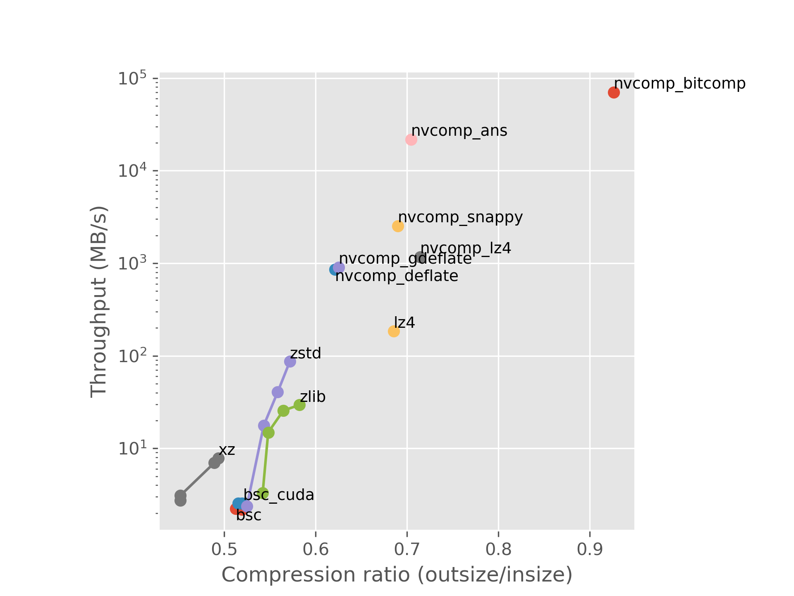
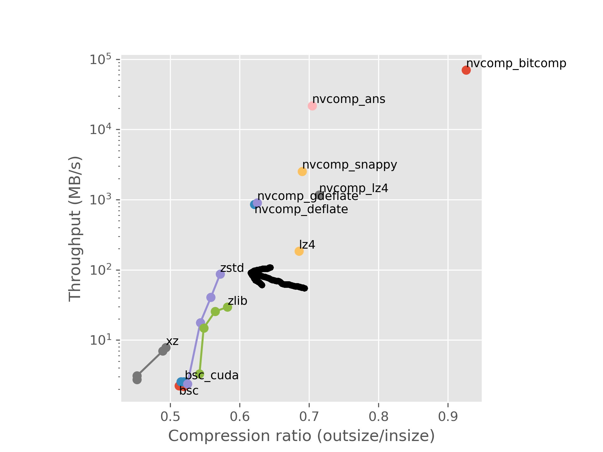
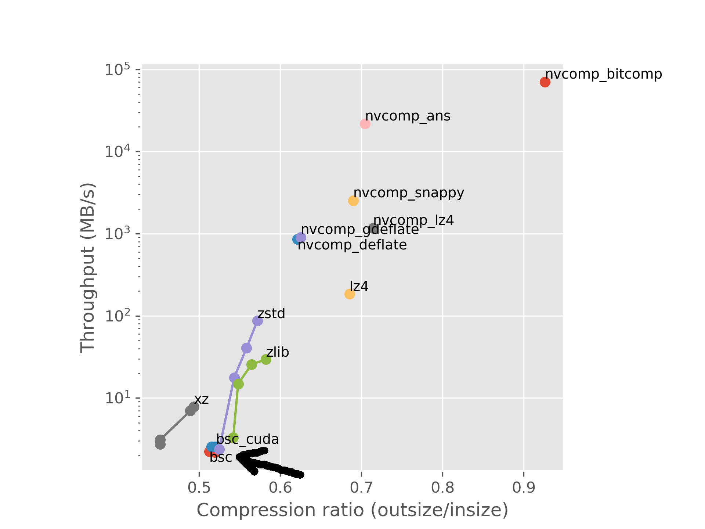
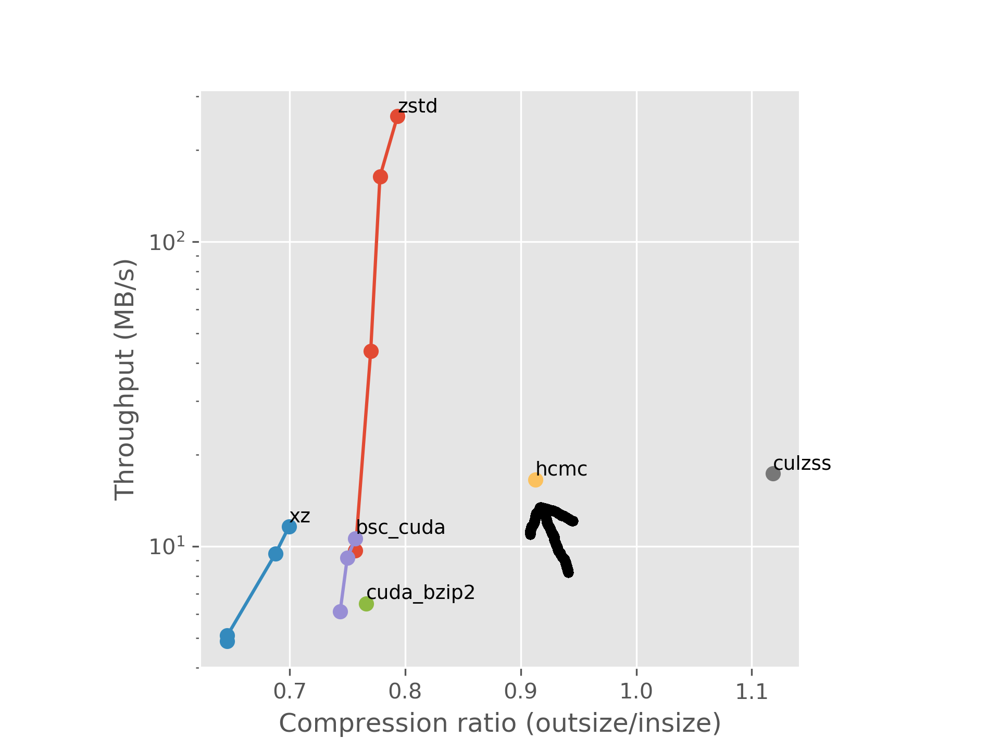
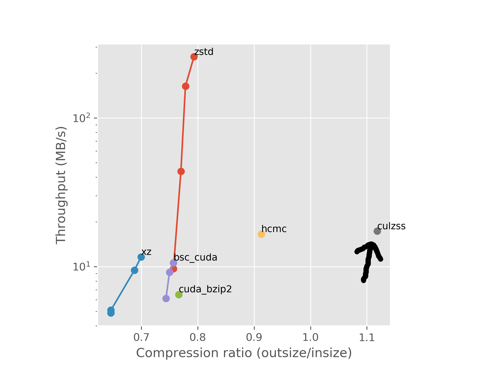
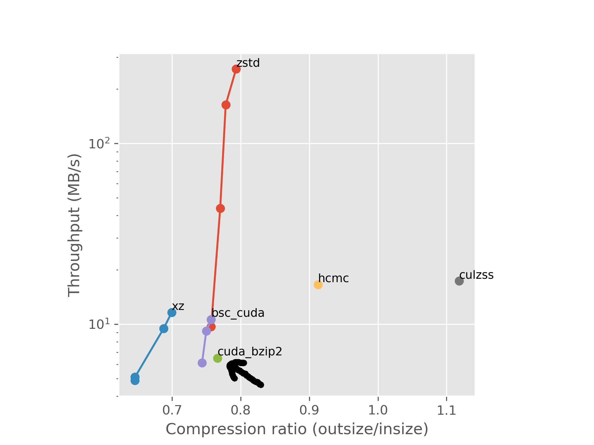
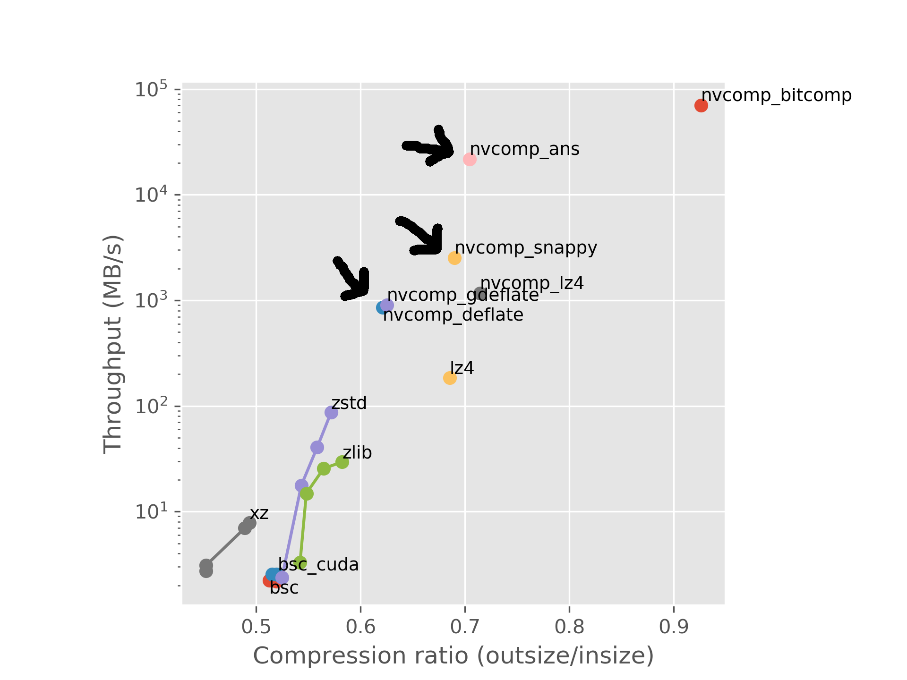

## Why?

- Data from the HLT is compressed
- This is done on CPUs
- GPUs can be very fast
- We have GPUs

## What I've been doing

- Looking for implementations by other people
- Comparing them to traditional CPU compressors

## Results (so far)

 \

## Results (so far)

 \

## Problems

Nvidia

 \
\

Researchers

 \

## Promising things

Facbook has an MIT-licensed GPU-enabled ANS implementation! [^dietgpu]

- Only a Python API for Torch tensors
- C++ API "coming soon"
- I'm trying to make use of the underlying C++ functions

[^dietgpu]: <https://github.com/facebookresearch/dietgpu>

## That's it for now

**Contact info**

Stefan Rua

`stefan.elias.rua@cern.ch` \
`stefan.rua@iki.fi`

## Extra

**Burrows-Wheeler transform** \
Sorts the data in a way that repeating patterns are near each other

**Huffman coding** \
Gives characters shorter codes based on frequency

**Lempel-Ziv compression** \
Replaces patterns with references to previous occurences

**Asymmetric numeral systems** \
Stores the data in an integer that is constructed based on probability of encountering a certain symbol

## Extra

**zstd:** LZ77 + ANS \
{ width=70% } \

## Extra

**bsc:** Burrows-Wheeler transform / higher order sort transform + LZ \
{ width=70% } \

<https://github.com/IlyaGrebnov/libbsc>

## Extra

**HuffmanCoding_MPI_CUDA:** Huffman coding \
{ width=70% } \

<https://github.com/smadhiv/HuffmanCoding_MPI_CUDA>

## Extra

**CULZSS:** LZSS \
{ width=70% } \

<https://github.com/adnanozsoy/CUDA_Compression>

## Extra

**cuda_bzip2:** BWT + Huffman \
{ width=70% } \

<https://github.com/aditya12agd5/cuda_bzip2>

## Extra

**ans:** ANS \
**snappy:** Modified LZ77 \
**deflate:** LZ77 + Huffman \
{ width=70% } \
