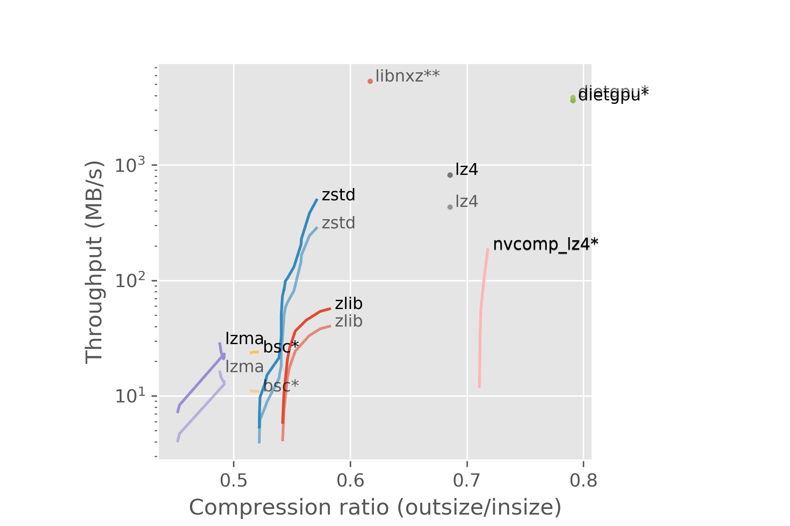

# Why?

- Data from the HLT is compressed
- This is done on CPUs
- GPUs can be very fast

# What I've been doing

- Looking for GPU compressor implementations
- Adding them to a benchmarking program
- Comparing them to CPU compressors

# Benchmarking

**lzbench**[^lzbench]

- Everything is compiled with the same options
- In-memory: excludes disk read/write times
- Already has a bunch of compressors

[^lzbench]: <https://github.com/inikep/lzbench>

# Compressors

**bsc**[^bsc]

**B**lock-**s**orting **c**ompressor by Ilya Grebnov.

[^bsc]: <https://github.com/IlyaGrebnov/libbsc>

# Compressors

**dietgpu**[^dietgpu]

Asymmetric numeral systems (ANS)[^ans] implementation by Facebook.

[^ans]: <https://arxiv.org/pdf/1311.2540.pdf>
[^dietgpu]: <https://github.com/facebookresearch/dietgpu>

# Compressors

**libnxz**[^libnxz]^,^[^libnxz_git]

- IBM's POWER9 processors have a hardware accelerator, NX, for gzip
- libnxz is the library for compressing on it

[^libnxz]: <https://dl.acm.org/doi/pdf/10.1109/ISCA45697.2020.00012>
[^libnxz_git]: <https://github.com/libnxz/power-gzip>

# Compressors

**nvcomp**[^nvcomp]^,^[^nvcomp_git]

Compression library by Nvidia, unfortunately made proprietary in version 2.3.

[^nvcomp]: <https://developer.nvidia.com/nvcomp>
[^nvcomp_git]: <https://github.com/NVIDIA/nvcomp>

# Data

**100 PP events**

- HadronsTaus stream from 2022
- pileup $\approx$ 50
- 100 files
- 170 MB
- 1.4 MB to 2.1 MB each

# Data

**100 HI events**

- from 2018
- 100 files
- 131 MB
- 644 KB to 5.5 MB each

# Machines

**HLT-like**

- AMD EPYC 75F3
- Nvidia Tesla T4

**POWER9**

- IBM POWER9
- 4 x Nvidia Tesla V100

# Results - PP

 \

\scriptsize * = GPU \
\scriptsize ** = NX

# Results - HI

 \

\scriptsize * = GPU \
\scriptsize ** = NX

# Conclusion

None of them seem to fit our needs all that well

# That's it

{ width=70% } \
<!--{ width=49% } \ -->

\ 

**Contact**

`stefan.elias.rua@cern.ch` \
`stefan.rua@iki.fi`

# Extra - less promising ones

These were just run from the command line and timed using the `time` command.

 \

# Extra - problems

Nvidia

 \
\

Researchers

 \

# Extra - machine details

**HLT-like**

- AMD EPYC 75F3
    - 32 cores
    - max. 4 GHz
    - 256 MB L3 cache
- Nvidia Tesla T4
    - 2560 CUDA cores
    - 16 GB GDDR6
    - 8.1 TFLOPS
<!-- - 130 int8 TOPS -->

# Extra - machine details

**POWER9**

- 8335-GTH / IBM Power System AC922
- IBM POWER9
    - 32 cores
    - max. 4 GHz
    - 320 MB L3 cache
- 4 x Nvidia Tesla V100
    - 5120 CUDA cores
    - 32 GB HBM2
    - 15.7 TFLOPS

<!--
# Timing

- Wall time
- Disk $\rightarrow$ RAM **excluded**
- RAM $\rightarrow$ GPU memory **included**
- Fastest from 5 repeats
-->
